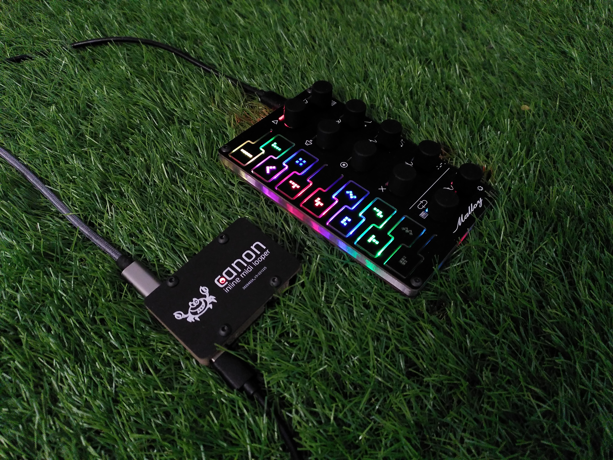

## PLEASE NOTE:
This is a low TRL device, and as such, please see known issues below.

## Overview
### Inputs and Outputs
- USB C to power and program
- USB C to connect to Controller
- 4x Midi TRS type A
  - Midi out to Synth
  - Midi in from Synth
  - Midi in from Computer/Master Clock
  - Midi out to computer/other
- 1x Trigger (3.5mm type) jack for pedal etc.

### Electronics
- Based on Adafruit ItsyBitsy MO Express https://www.adafruit.com/product/3727
- Processor: ATSAMD21 Cortex M0 processor running at 48 MHz
- External Memory: EEPROM 512k I2C
- 24 pin I/O Expander: PCAL6524HEAZ 
- Leds for indication: IN-PI55TATPRPGPB 
- Encoders, LDO power, Caps, Resistors etc

### Controls

- The controller works the same as the Matrix V2.
- This was an eariler version, that I used to experiment and debug the concept.
- THe Controller board needs some work, but the Inline Board (stand alone MIDI looper) is ready to go, and works quite well.
  

## Issues

### SCHEMATIC

### PCB

### CAD

### CODE

