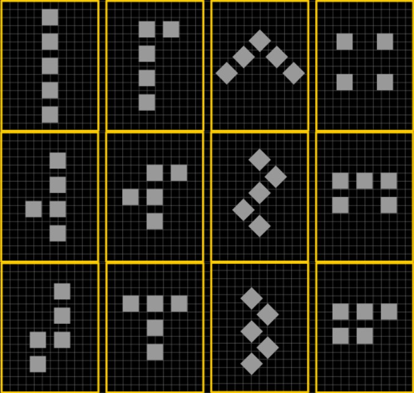
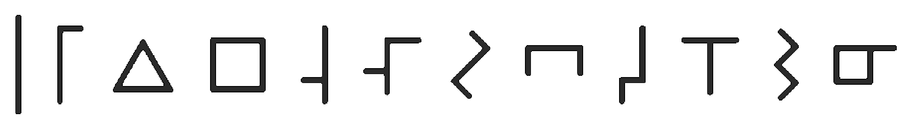

# Pentomino

I first discovered this when reading Arthur C. Clarke's 1975 novel Imperial Earth
After reading about Pentomino's on [wiki](https://en.wikipedia.org/wiki/Pentomino) I decided to make it more visually interesting, and to ensure the first 4 numbers represented and increase in sides (Line, 2 Sides, Triange, Square).

So what I have tried to do is to work with the base-12, and the 3x4 (and 3&4 are super interesting in music, from rhythm to harmonics - which you can't really get from a base-10).  We really need to move to a base-12 system.  So so much better.  

The 4 side is the Pentomino cross, but is shown as a negative, as it looks better, does not look like an addition or multiplication sign - and makes a square :-).

You can see the pattern repeating and growing in complexity (5 is a slight mod of one, 6 of 2 and so on.  9 slight mod of 5, 10 of 6 and so on).  Tried to not have the shapes the same as existing numbers.

You can see the evolution and repetition better here:

And in a more 'normal' writing

I have some CAD files [here](Pentomino/CAD) (solidworks, dxf, step)
