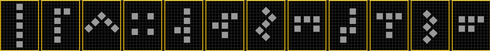

# Pentomino

I first discovered this when reading Arthur C. Clarke's 1975 novel Imperial Earth
After reading the  I decided to make it more visually interesting, and to ensure the first 4 numbers represented and increase in sides.

So what I have tried to do is to work with the base 12, and the 3x4.

You can see the evolution and repetition better here:

And in a more 'normal' writing

