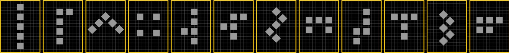

# Matrix-Sequencer
**Stand Alone Midi Sequencer**, for immediate visual interaction with hardware synthesizers

## What
Midi sequencer designed to be easy to modify for beginners, and low cost to make.
Based on Arduino.

Operates in:
- Loop Mode
- Song Mode
- Conductor Mode

### Basic Functions (left row):
- Start/Stop: Play using internal clock or external midi clock
- BPM change using encoder
- Loop Start and End points via encoder
- Record:
  - Overtop: using Encoder button
  - On-Play: holding foot pedal, recording starts when first note played. Recording stops with foot off pedal. Automatically cuts loop to nearest beat, so loops nice.
- Clear notes (via encoder button)

### Canon and Note Functions (right rows):
- Transpose (to scale, on/off beat, via encoder or key input)
- Phase (by multiples of loop, by amount in steps)
- Frequency (compress note sequence in time, in fractions of current loop length)
- Mirror Notes Pitch (with a user defined mirror plane, reflect notes in pitch axis)
- Mirror Notes Loop (with a user defined mirror plane, reflect notes in time)
- Note Cutofff Filter (mute notes like a LPF or HPF)
- Note Velocity (use finger to draw note velocity or encoder)
- Note Duration (use encoder to increase or decrease all note lengths)

### Additional Features:
- 256 events (not bound by bars or specific steps)
- Polyphonic
- Intuitive scales

## [Specifications Matrix V2 (encoder model)](MatrixV2/README.md)
## [Specifications Matrix V1](MatrixV1/README.md)
## [Specifications Inline (simple midi looper)](Inline/README.md)

## Why
### Hardware synthesizer problem:

Electronic music possesses both its greatest asset and its greatest drawback: the unparalleled flexibility it offers in sound creation. It's simple to purchase a laptop, load your favourite DAW software, and then to wake up, after you have nodded off to a loop running endlessly in your headphones. Perhaps you may get lucky, and a fortuitous accidental mouse click during your slumber may result in a masterpiece. However, it is more probable that your music will end up sounding sterile.

Hardware synthesizers currently provide immediacy, tangibility, reliability and lack of spontaneous OS updates, that PC's cannot provide.  But without expensive hardware, the only way to quickly layer sounds is to use built in key-holds playing standard arpeggios that steadily erode their beauty through endless repetition of the same up/down sequences.

Goal was to:
- make an interface that allows for quick note controller access, with immediate visual and tactile feedback - with a nod to the Reason Matrix
- Keep cost low.  There are solutions already that do similar things, but start at £650 upwards. 
- Enhance workflow and notation in areas that typically do not get attention, that have a meaningful impact of the quality of music, such as instant: 
  - Transposing in key
  - Phasing
  - High-pass and Low-pass velocity muting
  - Canon functions in key (Crab, Inversion, Reversing etc)
  - Hardware agnostic 303 style accents and glides
  - Velocity and length control
- Composer mode, allowing the user to play a midi keyboard, and to be able to select which fingers play which synthesizer (for example: left pinky plays bass, middle finger lead, first 3 fingers strings etc)
- Record mode, where it starts the recording only when you play, and stops the recording and automatically trims length when you remove you foot.  This allows seemless live looping.
- Loops that are not bound by 16,32 or 64 steps.  But is only bound by number of events.  In the current state, this is 255 events, over a 32bit length of steps (which at low tempo could be a 10 min loop)
- Scale not chosen by archaic and unrelatable names.  Notes (key) chosen by just selecting which white and black note you want it to stay on - yes, that simple.  (Does not currently handle option to change base notes if going up or down like in a some melodic minor scales - to be added) 
- Open source and easy to modify for non-programmers to allow people to add features and tweak to their setup.  I really tried to avoid the use of pointers, classes, libraries etc, as I wanted this to be software that anyone could modify - worts and all (I failed on the Midi Library - need remove this at some point)
- Fit into existing setups without changing anything (inline).
- Assemble at home with basic SMD tools, and a 3D printer.

## Contents of the repository

I have tried to include everything I created on this project.

Please note: There are some schematic errors which required minor board mods!!  I have not got around to updating the PCB files.  Please see notes in folders for each item.

Files are for:
- Matrix (second one - with encoders built in)
- Inline looper
- Inline controller
- Matrix (first one - with not encoders)

Each folder contains:
- PCB schematics
- PCB Kicad files
- Arduino Code
- Azoteq touch files
- CAD files (plastic)
- BOM (mostly mouser parts)

#### Numbering style is me having fun..  

We really need to move to a base-12 system.  So so much better.  This is my base-12 numbering, using the super cool Pentomino. See https://en.wikipedia.org/wiki/Pentomino  (thank you Arthur C Clake for enlightening me)

This is my sequence below.  Using the beauty of base 12, like in music there are those lovely 4x3's.  You can see the pattern repeating and growing in complexity (5 is a slight mod of one, 6 of 2 and so on.  9 slight mod of 5, 10 of 6 and so on).  Tried to not have the shapes the same as western numbers.

More info here: [PENTOMINO](Pentomino/INFORMATION.md)

I also wanted the first numbers to grow dimensionally 1 side, 2 side, 3 side (also shown as triangle), 4 side (Pentomino cross is shown as a negative, as it looks better - and makes a square :-) ). 

## Photos

# Other Verions

## First Verison

## Inline Midi 

## Who
My name is Chris Malloy.  I developed the Hoverbike back in 2006.  For the last 10 years, my fantastic team and I have built a sucessful company that makes large heavy lift unmanned vehicles (company: Malloy Aeronautics www.malloyaeronautics.com )

I needed a break from that type of engineering, so whilst still helping the company, I have spent the last year finding time to work on this, and de-bug and have lots of fun playing on my gear.
If you want to listen to some very novice music made using this Matrix seqencer, see:
https://soundcloud.com/caratacus_potts

A Vimeo channel with a video of an earlier version of the Matrix

All the best

Chris
