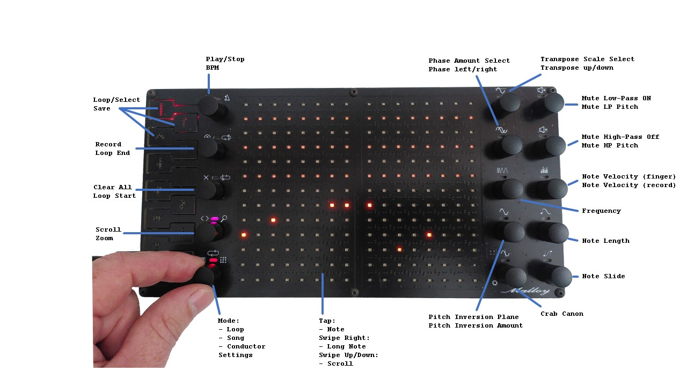
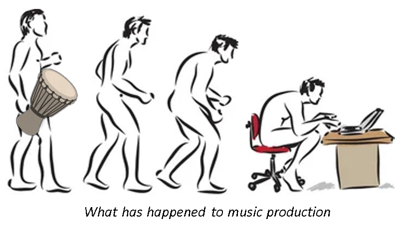
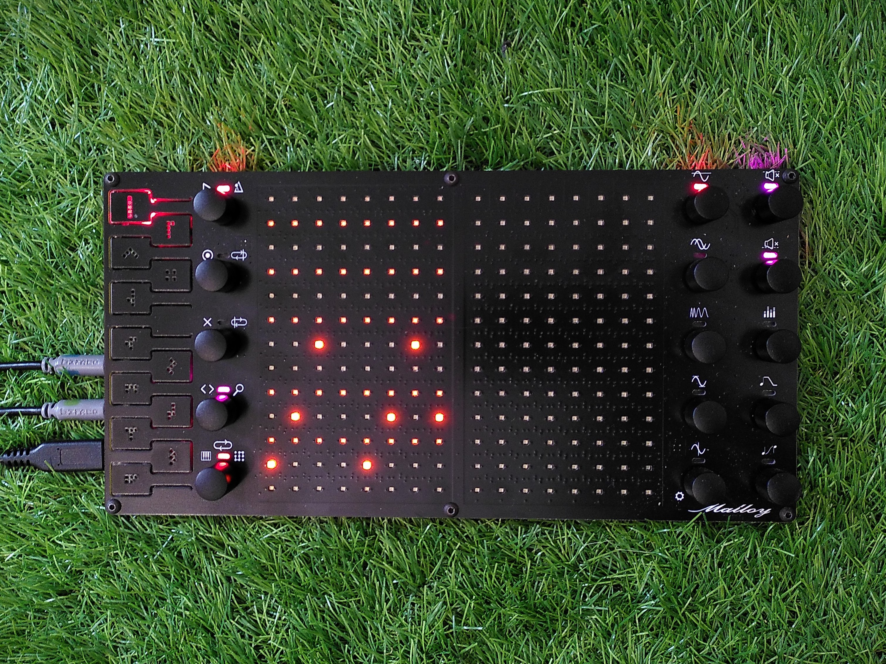
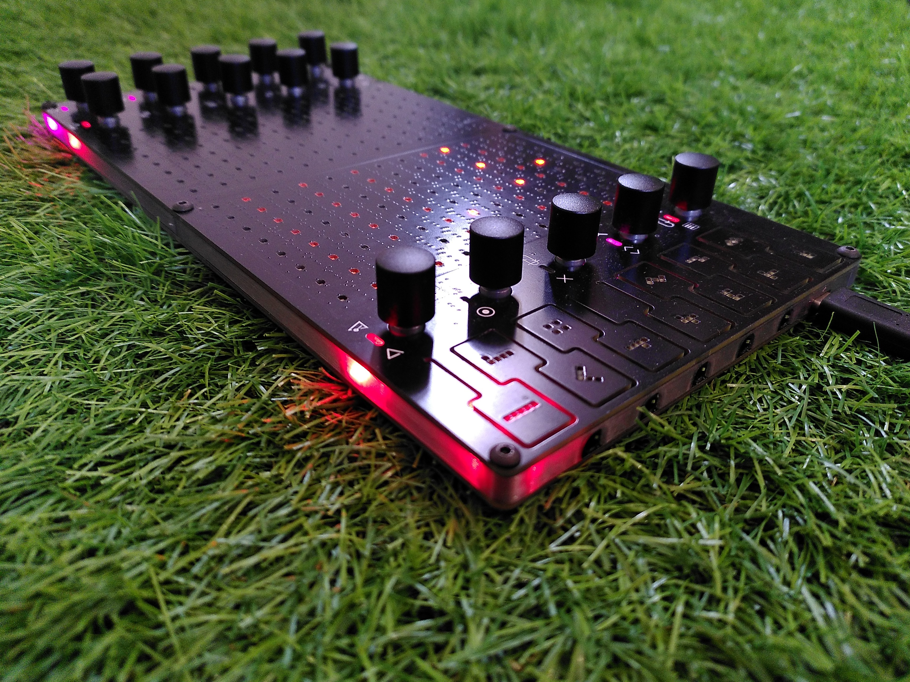
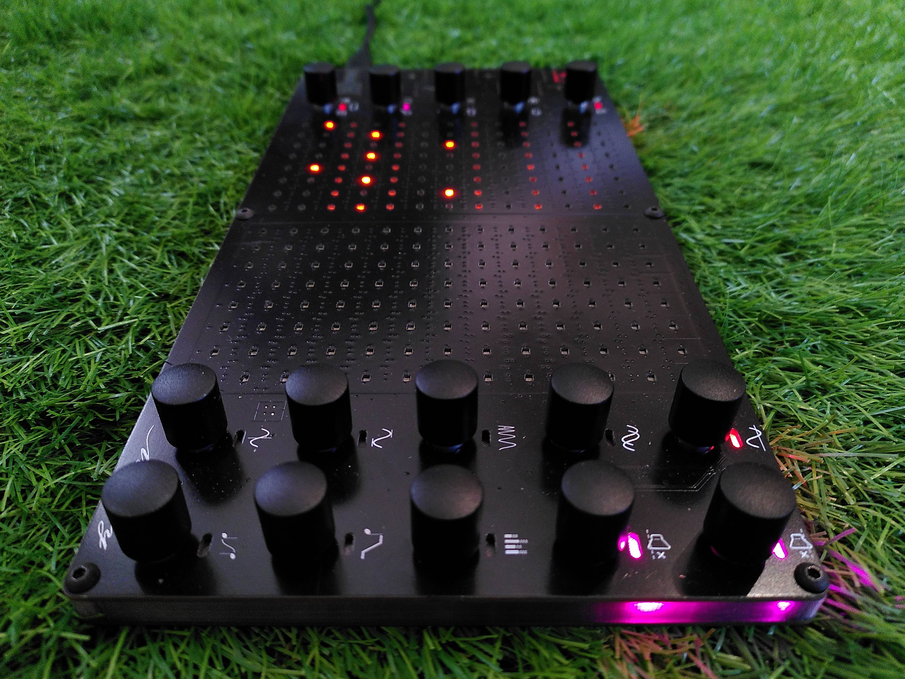
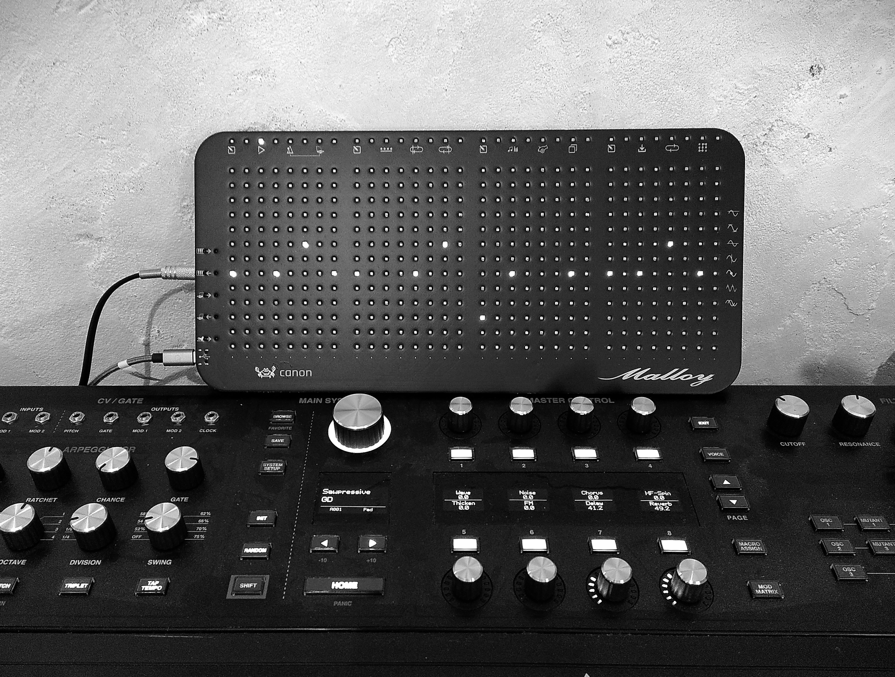
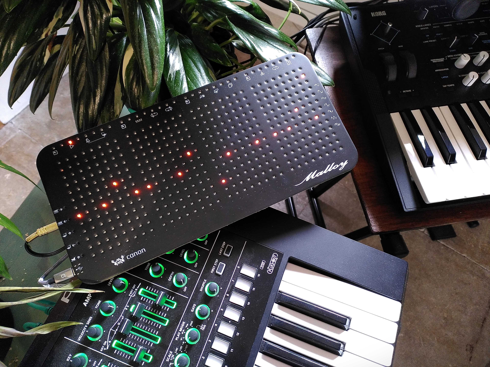
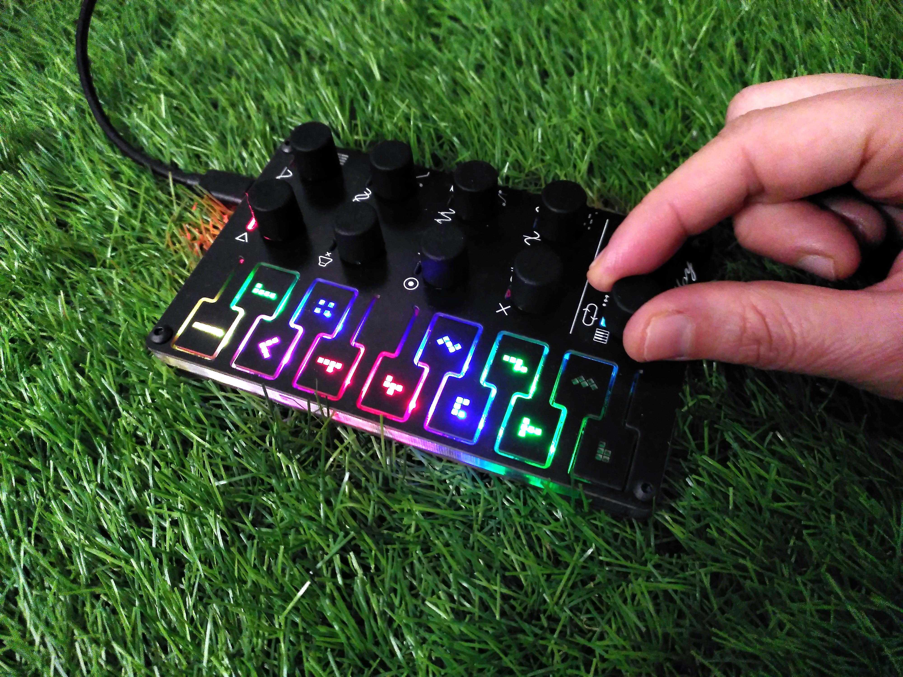
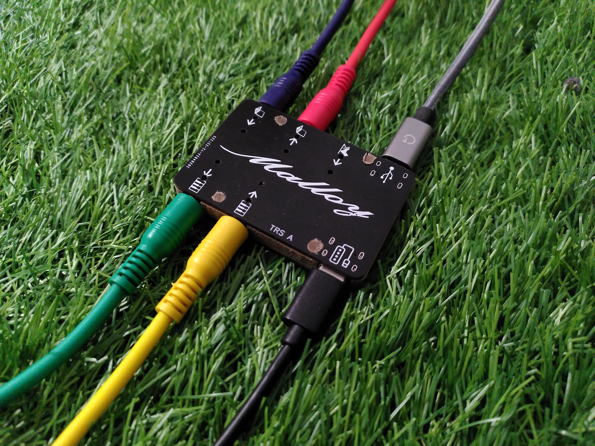
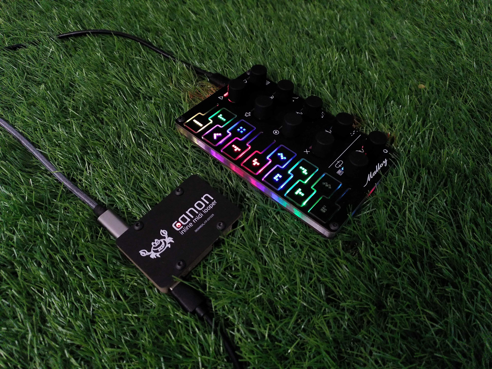

# Matrix-Sequencer
**Stand Alone Midi Sequencer**, for immediate visual interaction with hardware synthesizers

## What
Midi sequencer designed to be easy to modify for beginners, and low cost to make.

Operates in:
- Loop Mode
- Song Mode
- Conductor Mode

### Basic Functions:
- Start/Stop: Play using internal clock or external midi clock
- BPM change using encoder
- Loop Start and End points via encoder
- Record:
  - Overtop: using Encoder button
  - On-Play: holding foot pedal, recording starts when first note played. Recording stops with foot off pedal. Automatically cuts loop to nearest beat, so loops nice.
- Clear notes (via encoder button)

### Canon Functions:
- Transpose (to scale, on/off beat, via encoder or key input)
- Phase (by multiples of loop, by amount in steps)
- Frequency (compress note sequence in time, in fractions of current loop length)
- Mirror Notes Pitch (with a user defined mirror plane, reflect notes in pitch axis)
- Mirror Notes Loop (with a user defined mirror plane, reflect notes in time)
- Note Cutofff Filter (mute notes like a LPF or HPF)
- Note Velocity (use finger to draw note velocity or encoder)
- Note Duration (use encoder to increase or decrease all note lengths)

### Additional Features:
- 256 events (not bound by bars or specific steps)
- Polyphonic
- Intuitive scales

## Why
### Hardware synthesizer problem:

Electronic music possesses both its greatest asset and its greatest drawback: the unparalleled flexibility it offers in sound creation. It's simple to purchase a laptop, load your favourite DAW software, and then to wake up, after you have nodded off to a loop running endlessly in your headphones. Perhaps you may get lucky, and a fortuitous accidental mouse click during your slumber may result in a masterpiece. However, it is more probable that your music will end up sounding sterile.

Hardware synthesizers currently provide immediacy, tangibility, reliability and lack of spontaneous OS updates, that PC's cannot provide.  But without expensive hardware, the only way to quickly layer sounds is to use built in key-holds playing standard arpeggios that steadily erode their beauty through endless repetition of the same up/down sequences.

## Where

## Who

## When

## How
## Photos

# Other Verions

## First Verison

## Inline Midi 

